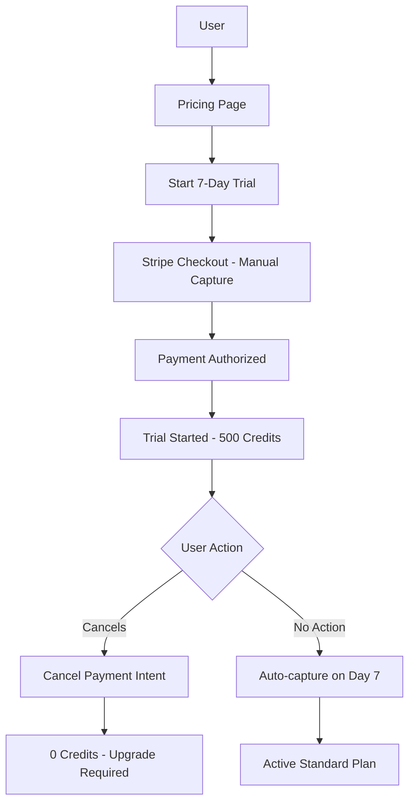

# 7-Day Trial System Implementation Summary

## 🎯 **Objective Completed**
Replaced the Free plan with a 7-day trial using Stripe's manual capture system. Users must now provide payment upfront but are only charged after 7 days if they don't cancel.

---

## ✅ **What We've Implemented (Phase 1)**

### 1. **Core System Changes**
- **Removed FREE plan entirely** from credit configuration
- **Added TRIAL plan type** with 500 credits
- **Updated all plan fallbacks** to default to Standard instead of Free
- **Implemented manual capture** using Stripe's [authorization and capture](https://docs.stripe.com/payments/place-a-hold-on-a-payment-method) system

### 2. **Credit Management Overhaul**
- **Zero credits for non-subscribers**: Users without subscription get 0 credits
- **Immediate Standard access**: Trial users get 500 credits instantly
- **Better error handling**: Clear "upgrade required" messages when credits = 0
- **Trial credit tracking**: Redis stores trial-specific metadata

### 3. **New API Endpoints**
```
POST /api/trial/start      - Starts trial after payment authorization
POST /api/trial/cancel     - Cancels trial and removes access immediately
POST /api/checkout-sessions - Updated to use manual capture instead of subscriptions
```

### 4. **Stripe Integration**
- **Manual capture setup**: 7-day authorization hold on customer's card
- **Payment intent tracking**: Store payment intent ID for trial management
- **Automatic cancellation**: Cancel payment intent if user cancels trial

### 5. **User Experience Updates**
- **Pricing page**: Removed Free tier, added "Start 7-Day Trial" button
- **Immediate feedback**: Clear error messages when credits are insufficient
- **Trial status**: Users see Standard plan benefits immediately

### 6. **Data Migration**
- **Downgrade script**: Sets all existing free users to 0 credits
- **Redis schema update**: Added trial-specific fields (paymentIntentId, trialEndDate, etc.)

---

## 📋 **Implementation Details**

### **Trial Flow:**
1. User clicks "Start 7-Day Trial" → Redirects to checkout
2. Stripe authorizes card (no charge) → Creates payment intent with `capture_method: 'manual'`
3. User gets immediate access to 500 Standard plan credits
4. After 7 days: Stripe automatically captures payment OR user cancels and card is not charged

### **Credit System:**
- **Trial Users**: 500 credits, planType = 'STANDARD', status = 'trial'
- **Downgraded Users**: 0 credits, can browse but can't use features
- **Paid Users**: Normal credit allocation based on their plan

### **Cancellation Logic:**
- **During trial**: Immediate access removal + Stripe payment intent cancellation
- **After trial converts**: Access until month end (standard cancellation flow)

---

## 🚧 **Still Needed (Phase 2)**

### 1. **Automated Payment Capture** (High Priority)
- Set up Stripe scheduled webhooks or cron job to capture payments on day 7
- Handle failed captures (expired cards, insufficient funds)
- Convert trial status to 'active' after successful capture

### 2. **Webhook Updates** (High Priority)
- Update webhook handlers for new payment intent events:
  - `payment_intent.succeeded` (trial converted to paid)
  - `payment_intent.payment_failed` (capture failed)
  - `payment_intent.canceled` (trial canceled)

### 3. **UI/UX Enhancements** (Medium Priority)
- Trial countdown display in dashboard
- "Cancel Trial" button in account settings
- Better upgrade prompts when credits = 0
- Trial status indicators throughout the app

### 4. **Frontend Integration** (Medium Priority)
- Update checkout success page to call `/api/trial/start`
- Add trial cancellation UI components
- Update credit balance displays for trial users

### 5. **Remaining Free Plan References** (Low Priority)
- Clean up any remaining Free plan references in:
  - Feature access control
  - Email templates
  - UI components
  - Error messages

---

## 🔧 **How to Deploy**

### **Before Deployment:**
```bash
# 1. Run the downgrade script (ONCE)
cd Auto-Analyst-CS/auto-analyst-frontend
node scripts/run-downgrade.js

# 2. Verify all free users have been downgraded
# Check Redis: HGETALL user:*:credits should show total: "0"
```

### **After Deployment:**
1. Test the trial flow with Stripe test cards
2. Verify trial users get immediate Standard access
3. Test trial cancellation flow
4. Monitor for any remaining Free plan fallbacks

---

## 💰 **Business Impact**

### **Positive Changes:**
- ✅ **Immediate revenue impact**: All users must provide payment info
- ✅ **Higher conversion**: Trial users experience full Standard features
- ✅ **Reduced free-rider problem**: No more permanent free users
- ✅ **Better user qualification**: Payment info acts as user quality filter

### **Considerations:**
- ⚠️ **Conversion tracking needed**: Monitor trial → paid conversion rates
- ⚠️ **Support volume**: May increase due to payment authorization questions
- ⚠️ **Competitive positioning**: Ensure trial period is competitive

---

## 📊 **Technical Architecture Changes**



---

## ⏰ **Estimated Timeline for Phase 2**

- **Automated capture system**: 2-3 days
- **Webhook updates**: 1-2 days  
- **UI/UX enhancements**: 2-3 days
- **Testing & deployment**: 1-2 days

**Total Phase 2**: ~6-10 days

---

## 🎉 **Ready to Go Live**

The core system is functional and ready for initial deployment. Users can:
- ✅ Start trials with payment authorization
- ✅ Get immediate Standard plan access  
- ✅ Cancel trials to avoid charges
- ✅ Be blocked from features when credits = 0

Phase 2 will add automation and polish, but the fundamental business requirement is met!