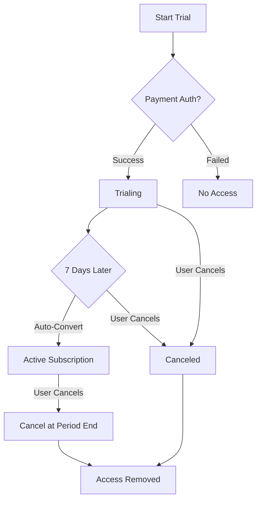

# Trial System

This document covers the complete 7-day trial system implementation in Auto-Analyst, including payment authorization, access management, and conversion logic.

## Overview

Auto-Analyst uses a 7-day free trial with Stripe subscription trials. Users must authorize a payment method to access the trial but are not charged until the trial period ends.

## Trial Flow Architecture

### High-Level Flow
```
[Start Trial] → [Payment Auth] → [Trial Access] → [Auto-Convert] OR [Cancel]
     ↓              ↓              ↓               ↓              ↓
[Pricing Page] → [Stripe Checkout] → [500 Credits] → [Paid Plan] → [Access Removed]
```

### Detailed Flow
1. User clicks "Start 7-Day Trial" on pricing page
2. Redirected to Stripe checkout with trial subscription
3. Payment method authorization required (no charge)
4. `checkout.session.completed` webhook fired
5. User calls `/api/trial/start` to activate trial
6. Immediate access with 500 Standard plan credits
7. After 7 days: Stripe automatically charges OR user cancels

## Implementation Components

### 1. Subscription Creation (Not Checkout Session)

**File**: `app/api/checkout-sessions/route.ts`

```typescript
export async function POST(request: NextRequest) {
  const { priceId, userId, planName, interval, promoCode } = await request.json()
  
  // Create or retrieve customer
  let customerId = await getOrCreateCustomer(userId)
  
  // Calculate trial end date
  const trialEndTimestamp = TrialUtils.getTrialEndTimestamp()
  
  // Create subscription with trial period
  const subscription = await stripe.subscriptions.create({
    customer: customerId,
    items: [{ price: priceId }],
    trial_end: trialEndTimestamp,
    expand: ['latest_invoice.payment_intent'],
    payment_behavior: 'default_incomplete',
    payment_settings: {
      save_default_payment_method: 'on_subscription',
    },
    metadata: {
      userId: userId || 'anonymous',
      planName,
      interval,
      priceId,
      isTrial: 'true',
      trialEndDate: TrialUtils.getTrialEndDate(),
    },
    // Apply coupon if provided
    ...(couponId && { coupon: couponId })
  })
  
  // Create setup intent for payment method collection if needed
  let clientSecret = subscription.latest_invoice?.payment_intent?.client_secret
  
  if (!clientSecret && subscription.status === 'trialing') {
    const setupIntent = await stripe.setupIntents.create({
      customer: customerId,
      usage: 'off_session',
      metadata: {
        subscription_id: subscription.id,
        is_trial_setup: 'true',
        userId: userId || 'anonymous',
        isTrial: 'true',
        planName,
        interval,
      },
    })
    clientSecret = setupIntent.client_secret
  }
  
  return NextResponse.json({ 
    subscriptionId: subscription.id,
    clientSecret: clientSecret,
    trialEnd: subscription.trial_end,
    isTrialSetup: !subscription.latest_invoice?.payment_intent
  })
}
```

### 2. Trial Activation

**File**: `app/api/trial/start/route.ts`

```typescript
export async function POST(request: NextRequest) {
  const { subscriptionId, planName, interval, amount } = await request.json()
  const token = await getToken({ req: request })
  const userId = token.sub
  
  // Retrieve and validate subscription
  const subscription = await stripe.subscriptions.retrieve(subscriptionId)
  
  if (subscription.status !== 'trialing') {
    return NextResponse.json(
      { error: 'Subscription is not in trial status' },
      { status: 400 }
    )
  }
  
  // Validate payment method is attached
  const hasPaymentMethod = await validatePaymentMethod(subscription)
  
  if (!hasPaymentMethod) {
    return NextResponse.json(
      { error: 'Payment method setup required. Please complete payment method verification.' },
      { status: 400 }
    )
  }
  
  // Store customer mapping for webhooks
  await redis.set(`stripe:customer:${subscription.customer}`, userId)
  
  // Store subscription data
  const now = new Date()
  const trialEndDate = TrialUtils.getTrialEndDate(now)
  
  await redis.hset(KEYS.USER_SUBSCRIPTION(userId), {
    plan: planName,
    planType: 'STANDARD',
    status: 'trialing',
    amount: amount ? amount.toString() : '15',
    interval: interval || 'month',
    purchaseDate: now.toISOString(),
    renewalDate: trialEndDate,
    lastUpdated: now.toISOString(),
    stripeCustomerId: subscription.customer as string,
    stripeSubscriptionId: subscription.id,
    trialEndDate: trialEndDate
  })
  
  // Initialize trial credits
  await creditUtils.initializeTrialCredits(userId, {
    total: TrialUtils.getTrialCredits(),
    resetDate: CreditConfig.getNextResetDate()
  })
  
  return NextResponse.json({
    success: true,
    trialStarted: true,
    credits: TrialUtils.getTrialCredits(),
    trialEndDate: trialEndDate,
    subscriptionId: subscription.id
  })
}
```

### 3. Payment Method Validation

```typescript
async function validatePaymentMethod(customerId: string): Promise<boolean> {
  try {
    // Check for attached payment methods
    const paymentMethods = await stripe.paymentMethods.list({
      customer: customerId,
      type: 'card'
    })
    
    if (paymentMethods.data.length > 0) return true
    
    // Check customer's default payment method
    const customer = await stripe.customers.retrieve(customerId)
    if (customer.invoice_settings?.default_payment_method) return true
    
    // Check setup intents for this customer
    const setupIntents = await stripe.setupIntents.list({
      customer: customerId,
      limit: 1
    })
    
    return setupIntents.data.some(si => si.status === 'succeeded')
  } catch (error) {
    console.error('Payment method validation error:', error)
    return false
  }
}
```

### 4. Trial Cancellation

**File**: `app/api/trial/cancel/route.ts`

```typescript
export async function POST(request: NextRequest) {
  const token = await getToken({ req: request })
  const userId = token.sub
  
  const subscriptionData = await redis.hgetall(KEYS.USER_SUBSCRIPTION(userId))
  const subscriptionId = subscriptionData.stripeSubscriptionId
  
  if (!subscriptionId) {
    return NextResponse.json(
      { error: 'No subscription found' },
      { status: 404 }
    )
  }
  
  const subscription = await stripe.subscriptions.retrieve(subscriptionId)
  
  if (subscription.status === 'trialing') {
    // Immediate cancellation for trials
    await stripe.subscriptions.cancel(subscriptionId, {
      prorate: false
    })
    
    // Mark as trial cancellation
    await redis.hset(KEYS.USER_CREDITS(userId), {
      trialCanceled: 'true'
    })
    
    return NextResponse.json({
      success: true,
      canceled: true,
      creditsRemoved: true,
      message: 'Trial canceled successfully'
    })
  } else {
    // Cancel at period end for active subscriptions
    await stripe.subscriptions.update(subscriptionId, {
      cancel_at_period_end: true
    })
    
    const periodEnd = new Date(subscription.current_period_end * 1000)
    
    return NextResponse.json({
      success: true,
      canceledAtPeriodEnd: true,
      accessUntil: periodEnd.toISOString(),
      message: 'Subscription will cancel at period end'
    })
  }
}
```

## Trial States

### State Management

```typescript
interface TrialState {
  status: 'trialing' | 'active' | 'canceled'
  trialStart?: string      // ISO timestamp
  trialEnd?: string        // ISO timestamp  
  hasPaymentMethod: boolean
  creditsGranted: boolean
  autoConvertEnabled: boolean
}
```

### State Transitions



### Status Synchronization

**Redis Storage**:
```typescript
// user:${userId}:subscription
{
  status: 'trialing',
  displayStatus: 'trialing',
  stripeSubscriptionStatus: 'trialing',
  trialStartDate: '2024-01-15T10:30:00.000Z',
  trialEndDate: '2024-01-22T10:30:00.000Z'
}
```

**Stripe to Redis Mapping**:
```typescript
const statusMapping = {
  'trialing': { status: 'trialing', displayStatus: 'Trial' },
  'active': { status: 'active', displayStatus: 'Active' },
  'canceled': { status: 'canceled', displayStatus: 'Canceled' },
  'past_due': { status: 'past_due', displayStatus: 'Past Due' }
}
```

## Webhook Integration

### Trial Conversion Webhook

**Event**: `invoice.payment_succeeded`

```typescript
// When trial ends and first payment succeeds
if (invoice.billing_reason === 'subscription_create') {
  await redis.hset(KEYS.USER_SUBSCRIPTION(userId), {
    status: 'active',
    stripeSubscriptionStatus: 'active',
    displayStatus: 'active',
    trialToActiveDate: new Date().toISOString(),
    trialEndedAt: new Date().toISOString()
  })
  
  // Refresh credits for new active status
  await subscriptionUtils.refreshCreditsIfNeeded(userId)
}
```

### Trial Cancellation Webhook

**Event**: `customer.subscription.deleted`

```typescript
await redis.hset(KEYS.USER_SUBSCRIPTION(userId), {
  status: 'canceled',
  stripeSubscriptionStatus: 'canceled',
  displayStatus: 'canceled',
  canceledAt: new Date().toISOString(),
  subscriptionDeleted: 'true'
})

// Zero out credits for canceled trials
await creditUtils.setZeroCredits(userId)
```

## Payment Authorization

### Stripe Configuration

```typescript
// No immediate charge during trial
const subscription = await stripe.subscriptions.create({
  customer: customerId,
  items: [{ price: priceId }],
  trial_period_days: 7,
  
  // Payment method will be charged after trial
  payment_behavior: 'default_incomplete',
  expand: ['latest_invoice.payment_intent']
})
```

### Authorization Validation

```typescript
// Ensure payment method is authorized before granting access
const paymentIntent = subscription.latest_invoice?.payment_intent

if (paymentIntent?.status !== 'succeeded') {
  throw new Error('Payment authorization required')
}
```

## Credit Management

### Trial Credit Allocation

```typescript
// Initialize 500 credits for trial users
await creditUtils.initializeTrialCredits(userId, {
  total: 500,
  resetDate: CreditConfig.getNextResetDate(),
  isTrialCredits: 'true',
  paymentIntentId: session.payment_intent.id
})
```

### Credit Preservation Logic

```typescript
// Credits preserved during successful trial conversion
// Only zeroed for genuine cancellations

function shouldZeroCredits(creditsData: any): boolean {
  // Genuine trial cancellation (user canceled before payment)
  if (creditsData.trialCanceled === 'true') return true
  
  // Subscription deleted (not converted to paid)
  if (creditsData.subscriptionDeleted === 'true') return true
  
  return false
}
```

## Frontend Integration

### Trial Start Button

```typescript
// components/pricing/TrialButton.tsx
function TrialButton({ priceId, planType }: TrialButtonProps) {
  const [isLoading, setIsLoading] = useState(false)
  
  const startTrial = async () => {
    setIsLoading(true)
    
    try {
      // Create checkout session
      const response = await fetch('/api/checkout-sessions', {
        method: 'POST',
        headers: { 'Content-Type': 'application/json' },
        body: JSON.stringify({ priceId, planType })
      })
      
      const { url } = await response.json()
      
      // Redirect to Stripe checkout
      window.location.href = url
    } catch (error) {
      console.error('Trial start failed:', error)
      setIsLoading(false)
    }
  }
  
  return (
    <Button onClick={startTrial} disabled={isLoading}>
      {isLoading ? 'Starting Trial...' : 'Start 7-Day Trial'}
    </Button>
  )
}
```

### Checkout Success Handler

```typescript
// app/checkout/success/page.tsx
'use client'

export default function CheckoutSuccess() {
  const searchParams = useSearchParams()
  const sessionId = searchParams.get('session_id')
  
  useEffect(() => {
    if (sessionId) {
      startTrial(sessionId)
    }
  }, [sessionId])
  
  const startTrial = async (sessionId: string) => {
    try {
      const response = await fetch('/api/trial/start', {
        method: 'POST',
        headers: { 'Content-Type': 'application/json' },
        body: JSON.stringify({ sessionId })
      })
      
      if (response.ok) {
        router.push('/chat?from=trial&refresh=true')
      } else {
        const error = await response.json()
        console.error('Trial activation failed:', error)
      }
    } catch (error) {
      console.error('Trial start error:', error)
    }
  }
}
```

## Error Handling

### Common Error Scenarios

1. **Payment Method Declined**
   ```typescript
   // Webhook: payment_intent.payment_failed
   // Action: Prevent trial access, show error message
   ```

2. **Checkout Session Expired**
   ```typescript
   // API Response: 400 Bad Request
   // Message: "Checkout session expired"
   ```

3. **Trial Already Started**
   ```typescript
   // API Response: 400 Bad Request
   // Message: "Trial already active for this user"
   ```

4. **3D Secure Required**
   ```typescript
   // Webhook: payment_intent.requires_action
   // Action: Redirect user to complete authentication
   ```

### Error Recovery

```typescript
// Automatic retry for failed payment authorization
const retryPaymentSetup = async (customerId: string) => {
  const setupIntent = await stripe.setupIntents.create({
    customer: customerId,
    payment_method_types: ['card'],
    usage: 'off_session'
  })
  
  return setupIntent.client_secret
}
```

## Testing

### Test Scenarios

1. **Successful Trial Flow**
   ```bash
   # Use test card: 4242424242424242
   # Expected: Trial access granted immediately
   ```

2. **Declined Payment**
   ```bash
   # Use test card: 4000000000000002
   # Expected: Trial access denied
   ```

3. **3D Secure Authentication**
   ```bash
   # Use test card: 4000002500003155
   # Expected: Additional authentication required
   ```

4. **Trial Cancellation**
   ```bash
   # Cancel within 7 days
   # Expected: Immediate access removal, no charge
   ```

5. **Trial Conversion**
   ```bash
   # Wait 7 days (or use Stripe CLI)
   # Expected: Automatic payment, continued access
   ```

### Stripe CLI Testing

```bash
# Trigger trial end event
stripe trigger invoice.payment_succeeded \
  --add invoice:billing_reason=subscription_create

# Trigger trial cancellation
stripe trigger customer.subscription.deleted
```

## Monitoring

### Key Metrics

- **Trial Conversion Rate**: % of trials that convert to paid
- **Trial Cancellation Rate**: % of trials canceled before conversion
- **Payment Authorization Success**: % of successful payment setups
- **Time to Trial Start**: Average time from signup to trial access

### Logging

```typescript
// Trial events logging
console.log('Trial started:', {
  userId,
  trialEndDate,
  creditsGranted: 500,
  paymentMethodVerified: true
})

console.log('Trial converted:', {
  userId,
  conversionDate: new Date().toISOString(),
  totalTrialDays: 7
})

console.log('Trial canceled:', {
  userId,
  cancellationDate: new Date().toISOString(),
  daysCanceled: daysIntoTrial
})
```

## Security Considerations

### Payment Authorization Validation
- Always verify payment method exists before granting access
- Validate Stripe webhook signatures
- Check session completion status
- Prevent duplicate trial activations

### User Access Control
- Trial access only with valid subscription
- Credit limits enforced server-side
- Session-based authentication required
- No client-side access control bypass

### Data Protection
- Encrypt sensitive payment data
- Log security events
- Monitor for unusual patterns
- Secure API endpoints with rate limiting